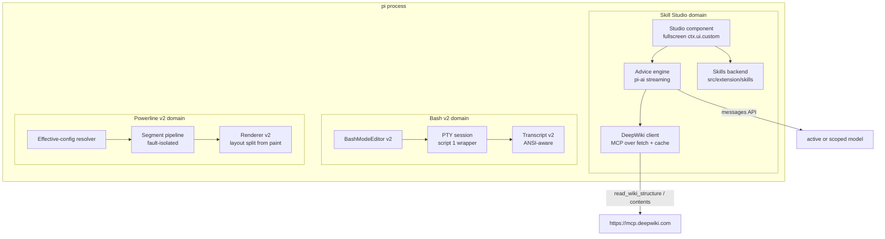
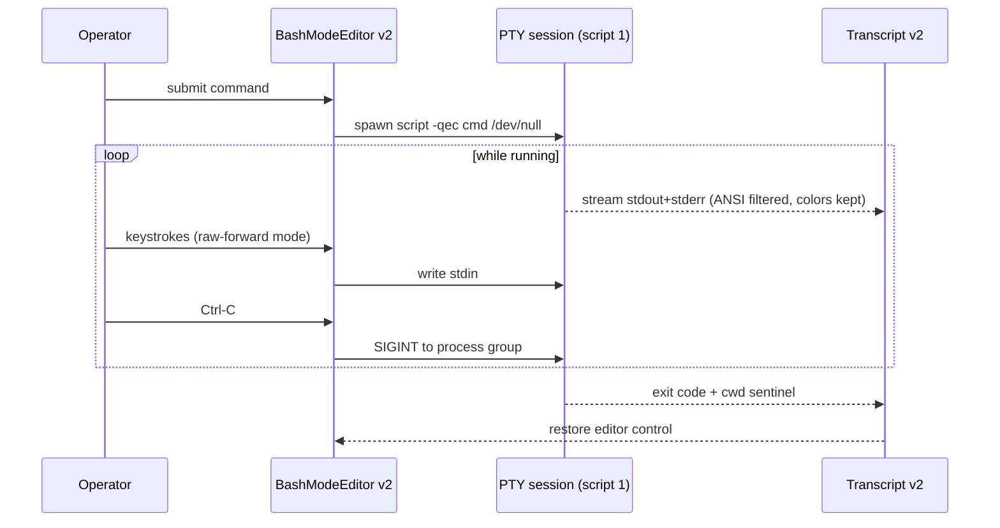
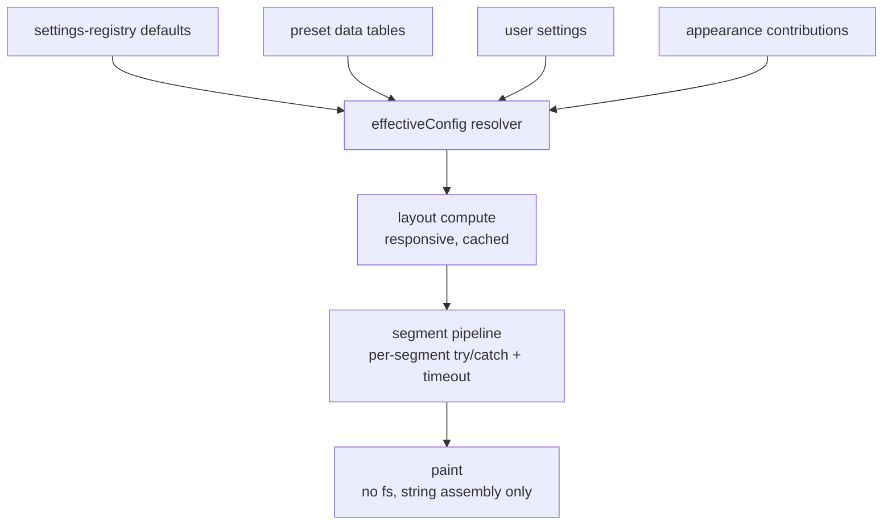

# Wishcraft v2 Platform - Plan

Full rewrite of bash mode and the powerline render line, plus an in-process Skill Studio with AI skill advising (DeepWiki-contexted), built on the pi CLI — not a standalone binary.

---

## Goal Capsule

- **Objective:** Ship pi-wishcraft v2 as three coherent rewrites: bash mode on a real PTY, a powerline pipeline with one config SSOT, and a fullscreen Skill Studio that feels like a standalone app while running inside pi, with AI advice about any skill (explanation, integration, examples) enriched by DeepWiki docs of the repos a skill references.
- **Authority:** Joep's direct request ("volledig rewrite … 100x beter … all in daarmee", 2026-08-28). Roadmap `ROADMAP.md` is the release contract; this plan is the working vehicle for the 1.5 "Craft Ecosystem" line and absorbs the 1.4d preset-decoupling theme into the v2 config line.
- **Execution profile:** Strangler per domain. Each track (bash, powerline, studio) lands v2 modules next to v1, cuts over per domain when parity and tests are green, then deletes v1 code in the same track.
- **Stop conditions:** None of the repo hard stops apply (no secrets, no force-push, no new laptop daemons). Stop only on a pi-core API break that cannot be worked around from an extension.
- **Tail ownership:** Each unit's executor owns its regression test and `Verify`-local gates (`typecheck`, `test`, `circular`). The dirigent owns sequencing, PR stacking, and cutover.

---

## Product Contract

### Summary

pi-wishcraft becomes the powerline, shell, and craft layer of pi. Bash mode v2 gives a real terminal-in-pi experience: PTY-backed execution, colors preserved, stdin forwarding, interrupt that works. Powerline v2 unifies configuration behind the settings registry and makes the render pipeline typed, fault-isolated, and paint-cheap. The Skill Studio is a fullscreen in-app workspace for the user's entire skill fleet — browse, inspect, create, edit, fix, and understand skills — where "understand" means asking an AI that sees the skill body, its local reference files, and the DeepWiki documentation of every GitHub repo the skill names.

### Problem Frame

Today bash mode runs commands through temp-file eval with pipes: no interactive stdin, all ANSI stripped to plain text, no job control (bash-mode/shell-session.ts:28,107,226). The powerline line parses config through two SSOTs (`src/config/parse.ts` vs `src/config/appearance.ts` + `presets.ts`, both consumed by `src/extension/ui/status-line-renderers.ts`), and render logic concentrates in large renderer files. Skill management exists in pieces inside wishcraft (manager, doctor, templates) while the pi-agent-control repo built a separate Ink studio binary aimed at Devin paths (`~/.devin/skills`), with no AI, no creation flow, and no pi-native discovery. There is no way to ask "what does this skill do, how do I integrate it here, show me examples" from inside pi.

### Actors

- A1. **Operator (Joep)** — power user of pi; drives the studio and bash mode daily.
- A2. **Extension runtime (pi-wishcraft inside pi)** — hosts all v2 surfaces; must degrade gracefully in `print`/`json` modes.

### Requirements

**Bash Mode v2**

- R1. Commands execute under a real PTY (via `script(1)`, no new native dependency), so interactive programs that read stdin work inside bash mode.
- R2. ANSI escape sequences survive into the transcript as color when the terminal supports it, while control-character noise is filtered; transcript byte/line caps still apply.
- R3. The operator can interrupt a running command (Ctrl-C) and forward typed input to a running process; the editor returns control when the process exits.
- R4. Cwd tracking, exit codes, shell detection (bash/zsh/fish), and settings keys from v1 are preserved through the v2 session.

**Powerline v2**

- R5. Powerline configuration resolves through exactly one effective-config resolver layered on `src/config/settings-registry.ts`; presets and appearance mixes are data consumed by that resolver, not a second parse path.
- R6. Every segment (builtin and contributed) renders behind per-segment fault isolation; a throwing segment never blanks the status line.
- R7. Paint cost stays within the existing always-on budgets: no filesystem access in the paint path and no background animation while idle.

**Skill Studio**

- R8. The studio opens as a fullscreen in-app view (`ctx.ui.custom()`), reachable by slash command, and presents itself like a standalone tool: its own keybindings, help screen, status bar, and pane focus model.
- R9. The studio lists every skill discoverable by the existing registry (project, global, prompts, extra) with search/filter, and shows per-skill detail: frontmatter, body, referenced files, health, shadow/override state, and usage stats.
- R10. From the studio the operator can create a skill from a template, edit it in place, toggle it, and run doctor diagnostics — reusing `src/extension/skills/` as the single backend (no second skill SSOT).
- R11. The studio's AI advice pane answers four modes about the selected skill — explain, integrate, examples, improve — using an in-process model call that includes the skill body, its local reference files, and DeepWiki content for GitHub repos named in the skill.
- R12. AI answers can be inserted into the active pi session as a composed prompt; the advice call itself never pollutes the session transcript.
- R13. DeepWiki data is fetched through the official MCP endpoint (`https://mcp.deepwiki.com/mcp`, no-auth), cached on disk with a TTL, and every network failure degrades to local context only with a visible notice.

**Cross-cutting**

- R14. All new operator-facing strings are English (repo contract; enforced by `tests/english-ui.test.ts`).
- R15. Every v1 code path replaced by v2 is deleted in the same track's cutover unit; no dead dual implementations remain.

### Acceptance Examples

- AE1. **Covers R1, R3.** Given bash mode v2 active, when the operator runs `git rebase -i HEAD~2` (or any stdin-reading program like `sudo`/`vim`-class prompts), then keystrokes typed in the editor reach the program and Ctrl-C interrupts it, with control returning to the editor at exit.
- AE2. **Covers R2.** Given a command printing colored output (e.g. `ls --color=auto`), when it finishes, then the transcript shows colors in a color-capable terminal and plain text under `NO_COLOR`.
- AE3. **Covers R5.** Given a user config that mixes a preset with per-segment option overrides, when the status line renders, then the effective config is identical whether derived from settings, preset, or contribution layers — verified by a round-trip resolver test.
- AE4. **Covers R6.** Given a contributed segment whose `render` throws, when the status line paints, then the remaining segments still render and the fault is logged once, not per frame.
- AE5. **Covers R8, R9, R11.** Given the studio open on a skill that references `https://github.com/earendil-works/pi-coding-agent`, when the operator invokes "explain", then the answer streams into the advice pane citing the skill body, local references, and DeepWiki content of that repo, and DeepWiki being unreachable downgrades the answer to local context with a notice.
- AE6. **Covers R12.** Given a finished advice answer, when the operator picks "insert into session", then the composed prompt lands in the editor and the transcript contains no hidden AI-call turns.

### Scope Boundaries

Non-goals for this plan:

- No changes to pi core (`@earendil-works/pi-coding-agent`) — extension surface only.
- No new runtime processes, daemons, or containers; the studio and AI calls run inside the pi process.
- No skill marketplace/install pipeline (roadmap 1.5 follow-up beyond studio basics).
- No Dutch UI; no retheming of the sidebar-anchored surfaces outside the studio's own panes.

Deferred to Follow-Up Work:

- Agent-callable tool wrappers (`skill_advise`, catalog query) exposing the advice engine and skill metadata to the session agent via `registerTool` — the pure-module boundary is kept for this (KTD4); wrapper scope (model selection, metadata depth, network guardrails) is decided then.
- pi-agent-control's standalone `bin/skill-studio` deprecation notice (after wishcraft studio ships).
- Remote-model routing for advice (pick a cheaper model than the session's) — the hook lands in v2, the picker UI is follow-up.
- `registerMotion()`/`registerRecipeOrAction()` contribution contracts (roadmap 1.4 remainder).

---

## Planning Contract

### Key Technical Decisions

- KTD1. **Strangler per domain, not big-bang.** Each track ships v2 beside v1 and cuts over independently. Rationale: three simultaneous rewrites with one shared cutover date concentrates risk; per-domain parity gates (`bash-mode.test.ts`, renderer tests) already exist to qualify each switch. Ceiling: temporary code duplication inside a track until its cutover unit lands.
- KTD2. **PTY via `script(1)` wrapper, no native dependency.** `node-pty` needs a native build; the repo is zero-build Bun/Node-native TS (AGENTS.md). `script -qec "<cmd>" /dev/null` (util-linux, present on Linux and macOS) allocates a real PTY per command with stdio piped through Node. Interactive stdin is forwarded by temporarily switching the editor to raw-forward mode. Upgrade path: swap the wrapper for `node-pty` only if `script(1)` gaps appear (window resizing via `SIGWINCH` passthrough is the known limit).
- KTD3. **Studio is a fullscreen `ctx.ui.custom()` component, in-process.** `ctx.ui.custom()` in its default (non-overlay) form temporarily replaces the editor area — that fullscreen variant is the studio surface. The existing Deck demonstrates the overlay variant (`overlay: true` with centered `overlayOptions`, `src/extension/ui/deck/index.ts:23-28`); the studio deliberately does not pass `overlay`. No separate binary, no second process, no Ink dependency. "Standalone feel" comes from the component owning the whole screen, its own keybindings and help — not from process separation.
- KTD4. **AI advice uses `@earendil-works/pi-ai` directly, in-process.** pi-ai is already a peerDependency. The advice engine resolves the session's active model (or a configured scoped model) via `ctx.modelRegistry` + `getProviderAuth`, streams through the pi-ai messages API, and renders into the studio pane. The session transcript stays untouched (R12); `ctx.sendUserMessage` is used only for explicit insert. Fallback when no key/model is available: visible "advice unavailable" notice. The engine and context builder stay UI-free modules (no studio imports) so agent-callable `registerTool` wrappers can be added later without rework.
- KTD5. **DeepWiki through the official MCP streamable-HTTP endpoint** (`https://mcp.deepwiki.com/mcp`, no-auth; tools `read_wiki_structure`, `read_wiki_contents`, `ask_question`). A minimal MCP client (~JSON-RPC over fetch, one file) lives in the studio domain. Disk cache under the pi data dir with TTL; offline degrades to local-only context (R13). Chosen over scraping `deepwiki.com` HTML: the MCP endpoint is the documented public contract and returns structured markdown.
- KTD6. **Powerline v2 config: settings-registry is the only SSOT.** An `effectiveConfig` resolver composes: registry defaults → preset data → user settings → appearance contributions. `src/config/parse.ts` shrinks to feeding the resolver; `appearance.ts`/`presets.ts` become data tables it consumes. This absorbs roadmap 1.4d (preset decoupling) into the v2 line.
- KTD7. **Studio backend = existing skills modules.** `src/extension/skills/` (registry, manager, doctor, templates) stays the single backend; the studio is a view + action layer over it. Boundary rule: `src/studio/` imports skills modules one-way; skills modules never import studio, and studio never imports `src/extension/core/state.ts` (callbacks arrive via the `ctx` passed into `open.ts`). The pi-control studio's Devin-centric paths (`~/.devin/skills`, `~/.config/devin`) are not carried over.
- KTD8. **English UI only**, extending `tests/english-ui.test.ts` to the new surfaces (governs R14).

### High-Level Technical Design

**v2 module topology** (new code only):

**Bash v2 execution flow** (AE1):

**Powerline v2 dataflow** (R5-R7):

### Assumptions

- `script(1)` from util-linux is available on all operator machines (Linux/macOS); a preflight check warns once if absent and falls back to v1 pipe execution per command.
- `mcp.deepwiki.com` stays no-auth and public; if it requires auth later, the cache and local-only degradation keep the studio functional (R13).
- The existing tests under `tests/` (node:test, flat) remain the harness; no new test framework.
- pi peer range stays `>=0.81.0 <0.85.0`; `ctx.ui.custom()`, `ctx.modelRegistry`, and pi-ai message APIs are stable within it.

### Sequencing

Three independent tracks, landable as stacked PRs: Track P (powerline: U1→U2→U11→U12), Track B (bash: U3→U4→U13), Track S (studio: U5→U6→U7, with U8/U9 parallel after U5, U10 after U8+U9). U14 closes all tracks. No cross-track dependencies; U12/U13 are the only units that delete v1 code.

---

## Risks and Dependencies

- **pi peer-range churn** (`>=0.81.0 <0.85.0`): `ctx.ui.custom()`, `ctx.modelRegistry`, and pi-ai message APIs could shift on a range bump. Mitigation: concentrate every pi-surface call behind two seams — `src/studio/open.ts` (UI/ctx) and `src/studio/advise/engine.ts` (model/auth) — so a range bump touches two files, and the assumption check in U8 fails loudly if the pi-ai surface moves.
- **DeepWiki endpoint drift** (no-auth promise, rate limits): mitigated by design in R13/U9 (disk cache, TTL, LRU cap, local-only degradation). A future auth requirement is a degraded-feature event, not an outage.
- **`script(1)` absence** on exotic hosts: preflight check + v1-pipe fallback per command with a one-time warning (U3); documented ceiling in Deferred Notes.
- **Strangler crossover drift**: while v1 and v2 coexist, settings keys are interpreted by both lines. Mitigation: U1 round-trip tests pin identical interpretation, and U11's golden compare between legacy delegation and v2 catches render drift before cutover.
- **Cutover rollback**: config keys and settings stay compatible through the strangler (R5), so each cutover PR (U12, U13) is a clean `git revert` target — no data migration, no on-disk format change. Golden-line snapshots in U12 give the pre-revert evidence.
- **Studio domain boundary**: a second skill SSOT or import cycle is the main architectural risk of `src/studio/`. Mitigation: KTD7 boundary rule plus the standing `npm run circular` gate in the Verification Contract.

---

## Implementation Units

### Unit Index

| U-ID | Title | Key files | Depends on |
| --- | --- | --- | --- |
| U1 | Powerline effective-config resolver | src/config/effective.ts, src/config/parse.ts | — |
| U2 | Segment pipeline v2 | src/segments/pipeline.ts, src/segments/registry.ts | U1 |
| U3 | PTY session core | bash-mode/pty-session.ts | — |
| U4 | Bash v2 editor + transcript wiring | bash-mode/editor.ts, bash-mode/transcript.ts | U3 |
| U5 | Studio shell (fullscreen component) | src/studio/component.ts, src/studio/state.ts | — |
| U6 | Studio browse + inspect panes | src/studio/panes/ | U5 |
| U7 | Studio actions (create/edit/toggle/doctor) | src/studio/actions.ts | U6 |
| U8 | AI advice engine | src/studio/advise/engine.ts | — |
| U9 | DeepWiki client + cache | src/studio/deepwiki/ | — |
| U10 | Advice pane + session insert | src/studio/panes/advice.ts | U6, U8, U9 |
| U11 | Renderer v2 (layout/paint split) | src/render/, src/extension/ui/status-line-renderers.ts | U2 |
| U12 | Powerline cutover + v1 deletion | src/config/, src/segments/ | U11 |
| U13 | Bash cutover + v1 deletion | bash-mode/ | U4 |
| U14 | Docs, roadmap, changelog, release prep | docs/, ROADMAP.md, CHANGELOG.md | U12, U13 |

### U1. Powerline effective-config resolver

- **Goal:** One SSOT for powerline config: a resolver that composes registry defaults, preset data, user settings, and appearance contributions into a typed `EffectivePowerlineConfig`.
- **Requirements:** R5
- **Dependencies:** none
- **Files:** `src/config/effective.ts` (new), `src/config/parse.ts`, `src/config/presets.ts`, `src/config/appearance.ts`, `src/config/types.ts`, `tests/effective-config.test.ts` (new)
- **Approach:**
  1. Define `EffectivePowerlineConfig` as the single render-input type; all consumers migrate to it in U11/U12.
  2. Reduce `parse.ts` to settings extraction feeding the resolver; presets and appearance become declarative data the resolver layers (defaults → preset → user → contributions).
  3. Keep existing settings keys valid; the resolver is additive until cutover (KTD1).
- **Patterns to follow:** `src/config/settings-registry.ts` (O(1) maps, `SETTING_DEFAULTS`, typed groups).
- **Test scenarios:**
  - Defaults only → effective config equals registry defaults.
  - Preset + user override of one segment option → user wins; sibling preset values survive (Covers AE3).
  - Round-trip: settings derived from an effective config resolve back to the same effective config.
  - Unknown preset id → resolver falls back to defaults and reports a validation warning.
  - Appearance contribution overriding a preset token → contribution wins in its declared scope only.
- **Verification:** `npm run typecheck && npm test -- --test-name-pattern effective` green; `npx madge --circular src` clean.

### U2. Segment pipeline v2

- **Goal:** Typed, fault-isolated segment execution pipeline that both builtin and contributed segments flow through.
- **Requirements:** R6, R5
- **Dependencies:** U1
- **Files:** `src/segments/pipeline.ts` (new), `src/segments/registry.ts`, `src/segments/core.ts`, `src/segments/types.ts` (new, moved from `src/config/types.ts` segment types), `tests/segment-pipeline.test.ts` (new)
- **Approach:**
  1. Define the v2 segment contract (id, render(ctx) → RenderedSegment, optional ttl/cost hints) and a pipeline that executes segments with per-segment try/catch plus a render-budget guard.
  2. Route builtin `SEGMENTS` and `getContributedSignalSources()` through the same pipeline entry.
  3. Cache segment results keyed by (id, ctx-version) so unchanged context does not re-render (R7).
- **Patterns to follow:** contribution fault isolation in `src/signal/render.ts:196-203`.
- **Test scenarios:**
  - Throwing builtin segment → siblings render, fault logged once (Covers AE4).
  - Throwing contributed source → same isolation.
  - Two consecutive paints with unchanged context → second paint reuses cached results (no re-render side effects observable via a counter-segment).
  - Segment exceeding render budget → degraded to hidden with a one-time warning.
- **Verification:** Pipeline tests green; `renderSignal` call sites compile against the pipeline.

### U3. PTY session core

- **Goal:** Replace temp-file eval execution with a `script(1)`-backed PTY session supporting stdin, ANSI passthrough, and interrupt.
- **Requirements:** R1, R2, R3, R4
- **Dependencies:** none
- **Files:** `bash-mode/pty-session.ts` (new), `bash-mode/types.ts`, `tests/pty-session.test.ts` (new)
- **Approach:**
  1. `PtyShellSession` wraps `spawn("script", ["-qec", "<cmd>", "/dev/null"], ...)` with piped stdio; stdout/stderr stream through an ANSI filter that keeps SGR/color sequences and cursor text, strips raw control noise (replacing today's full strip at `bash-mode/shell-session.ts:28`).
  2. Sentinel-based cwd/exit tracking from v1 (`shell-session.ts` sentinels) carries over; exit codes via close-code mapping already in v1.
  3. `writeStdin(data)` and `interrupt()` (SIGINT to process group) APIs for the editor; preflight `command -v script` check with v1 fallback and one-time warning (KTD2).
- **Patterns to follow:** v1 `ManagedShellSession` lifecycle (ready sentinel, command records, kill on dispose).
- **Test scenarios:**
  - Simple command → output captured, exit code and cwd correct.
  - Command emitting SGR colors → filtered stream retains color escapes; control chars (e.g. `\x07`) removed.
  - `NO_COLOR` env → transcript rendered plain (filter respects capability flag).
  - stdin-reading command (`read` in bash) → `writeStdin` unblocks it; exit code reflects the program.
  - `interrupt()` on a sleeping command → exit code 130.
  - Missing `script` binary → session reports fallback, no crash.
  - Dispose during running command → child killed, no orphan process (assert via pid liveness).
- **Verification:** All PTY tests green on Node 22 and 24; no new dependencies in `package.json`.

### U4. Bash v2 editor + transcript wiring

- **Goal:** Wire `BashModeEditor` and transcript to the PTY session: raw-forward mode while a process runs, ANSI-aware transcript caps.
- **Requirements:** R1, R3, R2
- **Dependencies:** U3
- **Files:** `bash-mode/editor.ts`, `bash-mode/editor-input.ts`, `bash-mode/transcript.ts`, `bash-mode/types.ts`, `src/extension/commands/bash-mode-actions.ts`, `tests/bash-mode-v2.test.ts` (new)
- **Approach:**
  1. Editor gains a forward state: while `running`, printable keys and control keys route to `writeStdin`; Ctrl-C routes to `interrupt`; editor renders a live output tail.
  2. Transcript v2 stores filtered-but-colored output; byte caps count visible width, not raw escape bytes (approximation documented in code).
  3. Ghost/completion/history features ride along unchanged (they operate pre-submit).
- **Patterns to follow:** existing editor tests in `tests/bash-mode.test.ts` (ghost stepping, undo, paste).
- **Test scenarios:**
  - Submit → editor enters forward mode; process exit restores editing.
  - Ctrl-C during run → interrupt + control return (Covers AE1).
  - Colored output → transcript record carries ANSI; truncation keeps valid escape pairing (no dangling SGR).
  - Existing v1 editor behaviors (history browse, ghost accept, bracketed paste) still pass against v2 wiring.
- **Verification:** `npm test` bash suites green; manual smoke via `npm run preview`.

### U5. Studio shell (fullscreen component)

- **Goal:** The fullscreen studio component with pane framework, keybindings, focus model, help overlay, and command registration.
- **Requirements:** R8, R14
- **Dependencies:** none
- **Files:** `src/studio/component.ts` (new), `src/studio/state.ts` (new), `src/studio/types.ts` (new), `src/studio/open.ts` (new), `src/extension/commands/commands.ts` (register `/studio`), `tests/studio-component.test.ts` (new)
- **Approach:**
  1. `openSkillStudio(ctx)` uses `ctx.ui.custom()` in default (non-overlay) fullscreen mode — the editor-replacing variant, not the Deck's centered overlay — with a component managing pane list/detail/actions/advice.
  2. Central input router with mode states (normal, filter, confirm); keys: `j/k` navigate, `/` filter, `?` help, `Tab` cycle pane focus, `q`/`Esc` exit.
  3. Non-TUI modes (`ctx.mode` print/json): `/studio` prints a notice and exits; RPC mode renders a notice (`custom()` unavailable).
- **Patterns to follow:** Deck component lifecycle (entry/exit handling) and `src/extension/skills/skill-manager.ts` UI state handling; overlay chrome styling from `src/extension/ui/overlay-chrome.ts`.
- **Test scenarios:**
  - Key routing per mode state (normal vs filter vs help).
  - Focus cycling across panes wraps correctly.
  - Exit restores prior editor state.
  - `print` mode invocation is a no-op with notice, no crash (R14 strings, English).
- **Verification:** Component tests green; `/studio` opens in `npm run preview` smoke.

### U6. Studio browse + inspect panes

- **Goal:** List and detail panes over the skills backend: search/filter, frontmatter/body/reference rendering, health, shadow state, usage.
- **Requirements:** R9, R8
- **Dependencies:** U5
- **Files:** `src/studio/panes/list.ts`, `src/studio/panes/detail.ts` (new), `src/studio/inspect.ts` (new: reference-file resolution), `tests/studio-inspect.test.ts` (new)
- **Approach:**
  1. List pane renders `loadSkillCatalog()` entries with source badges, valid/warn/error marks, usage counts, shadow indicators.
  2. Detail pane renders frontmatter, body preview, and resolved reference files (paths mentioned in body under `references/`, `scripts/` relative to the skill dir).
  3. Shadow/override diff view reuses diff logic modeled on the pi-control studio's `doDiff` but against pi-native paths (KTD7).
- **Patterns to follow:** `src/extension/skills/skill-doctor.ts` row rendering; `tests/inline-invocation.test.ts` catalog fixtures.
- **Test scenarios:**
  - Catalog with mixed sources → list shows all with badges; filter matches name+description substring.
  - Skill with references → detail lists resolvable files; missing file shows a broken marker.
  - Shadowed skill → diff view available; non-shadowed shows "no override".
  - Malformed frontmatter → warn/error marker matches doctor classification.
- **Verification:** Inspect tests green; detail rendering matches doctor's classifications for the same fixtures.

### U7. Studio actions (create/edit/toggle/doctor)

- **Goal:** Action pane wiring create-from-template, in-place edit, toggle, and doctor flows onto existing backend modules.
- **Requirements:** R10
- **Dependencies:** U6
- **Files:** `src/studio/actions.ts` (new), `src/studio/panes/actions.ts` (new), `src/extension/skills/skill-templates.ts`, `src/extension/skills/skill-doctor.ts`, `tests/studio-actions.test.ts` (new)
- **Approach:**
  1. Actions map 1:1 to backend calls: `writeSkillFromTemplate`, external `$EDITOR`-style edit via `ctx.ui.editor` or temp editor, enable/disable through the registry's filter mechanism, doctor diagnostics inline.
  2. Destructive actions (delete/overwrite) require an explicit confirm step in the action pane.
- **Patterns to follow:** `skill-manager.ts` action handling; `ctx.ui.confirm` timed-confirm pattern from pi docs.
- **Test scenarios:**
  - Create from template → SKILL.md exists on disk with expected frontmatter; list refreshes.
  - Toggle → registry filter updated; invalidation honored on next catalog read.
  - Doctor run inside studio → same issue set as `/skills doctor` for identical fixture tree.
  - Overwrite confirm declined → file untouched.
- **Verification:** Action tests green; filesystem assertions use temp dirs (existing test fixtures pattern).

### U8. AI advice engine

- **Goal:** In-process advice engine offering explain/integrate/examples/improve modes with composed context, streamed via pi-ai.
- **Requirements:** R11, R12
- **Dependencies:** none (parallel with U6/U7 after U5)
- **Files:** `src/studio/advise/engine.ts` (new), `src/studio/advise/prompts.ts` (new), `src/studio/advise/context.ts` (new), `tests/advise-engine.test.ts` (new)
- **Approach:**
  1. Context builder assembles: skill frontmatter+body, resolved reference files (shared with U6 inspect), DeepWiki sections for extracted repos (U9), capped to a token budget with priority body > references > wiki.
  2. Engine resolves model via `ctx.modelRegistry` (active model, or `wishcraft.studio.model` scoped setting when set) and `getProviderAuth`; streams the answer through the pi-ai messages API (KTD4).
  3. Abort support via `AbortSignal` (Esc cancels); no-key path returns a structured "unavailable" result.
- **Patterns to follow:** `ctx.signal` abort usage in pi extension docs; token capping helpers from `src/usage/`.
- **Test scenarios:**
  - Mode explain with full context → prompt contains body, one reference excerpt, wiki excerpt (assert on composed prompt fixture).
  - Token cap → lowest-priority wiki sections dropped first.
  - Abort mid-stream → engine resolves cleanly, no dangling listeners.
  - No model/key → "unavailable" result, no throw.
  - DeepWiki data absent → context marked local-only; prompt notes missing wiki (Covers AE5 partial).
- **Verification:** Engine tests green with a faux provider (pi-ai `faux` provider export).

### U9. DeepWiki client + cache

- **Goal:** Minimal MCP streamable-HTTP client for `mcp.deepwiki.com` with repo extraction, disk cache, TTL, and graceful offline behavior.
- **Requirements:** R13
- **Dependencies:** none (parallel with U6/U7 after U5)
- **Files:** `src/studio/deepwiki/client.ts` (new), `src/studio/deepwiki/extract.ts` (new), `src/studio/deepwiki/cache.ts` (new), `tests/deepwiki.test.ts` (new)
- **Approach:**
  1. `extract.ts` pulls `owner/repo` tokens from GitHub URLs and bare `owner/repo` mentions in the skill body.
  2. `client.ts` implements JSON-RPC-over-fetch for `read_wiki_structure` + `read_wiki_contents` (initialize handshake, tool call, response unwrap) — one file, no MCP SDK dependency (KTD5).
  3. `cache.ts` stores per-repo wiki snapshots under the pi data dir (`~/.pi/agent/wishcraft-cache/deepwiki/`), TTL 7 days, LRU size cap; network failure serves stale cache with a staleness flag.
- **Test scenarios:**
  - Repo extraction from URLs, org/repo mentions, and noise (paths that look like repos but aren't GitHub links) — precision case.
  - Client handshake + tool call against a local faux HTTP server (node http test server).
  - Cache hit within TTL → no network call; expired → refresh attempted.
  - Network down + fresh cache absent → local-only degradation signal; with stale cache → stale data flagged.
- **Verification:** DeepWiki tests green offline (faux server only); no runtime dependency added.

### U10. Advice pane + session insert

- **Goal:** Studio advice pane rendering streamed answers with mode switcher, and "insert into session" action.
- **Requirements:** R11, R12
- **Dependencies:** U6, U8, U9
- **Files:** `src/studio/panes/advice.ts` (new), `src/studio/open.ts`, `tests/studio-advice.test.ts` (new)
- **Approach:**
  1. Advice pane streams engine output as it arrives; footer shows mode + context sources (body/references/wiki counts, staleness).
  2. Insert action composes a prompt from the selected mode + answer summary and calls `ctx.ui.setEditorText`/paste path after studio exit — the transcript records only the explicit insert (R12).
- **Patterns to follow:** streaming working-indicator patterns from pi docs (`setWorkingMessage` analog inside custom component).
- **Test scenarios:**
  - Mode switch re-issues request with new mode prompt.
  - Stream chunks render incrementally; Esc aborts and shows partial + aborted marker.
  - Insert → editor receives composed prompt; session transcript contains no advice-engine turns (Covers AE6).
  - Unavailable engine → pane shows notice + retry action.
- **Verification:** Advice pane tests green; manual AE5 walkthrough in preview.

### U11. Renderer v2 (layout/paint split)

- **Goal:** Split `status-line-renderers.ts` into a pure layout computation (responsive, testable) and a cheap paint assembly consuming the segment pipeline.
- **Requirements:** R7, R5
- **Dependencies:** U2
- **Files:** `src/render/layout.ts` (new), `src/render/paint.ts` (new), `src/extension/ui/status-line-renderers.ts`, `src/extension/ui/signal-layout.ts`, `tests/render-v2.test.ts` (new)
- **Approach:**
  1. Layout consumes `EffectivePowerlineConfig` + segment results → lane assignments per width class; pure function, cached per (width, config-version).
  2. Paint assembles strings only: no fs, no git calls (those live in segment execution), no theme reload.
  3. Legacy `getResponsiveLayout` delegates to v2 behind the same entrypoint until U12.
- **Patterns to follow:** existing width-class logic in `status-line-renderers.ts`; 0-FPS idle discipline from roadmap always-on section.
- **Test scenarios:**
  - Widths 40/80/120+ produce valid lane assignments with all visible segments placed.
  - Identical (width, config) → cached layout reused.
  - Paint with `NO_COLOR`/legacy/functional modes → correct plain output.
  - Identical preset fixtures render identically through legacy delegation and v2 (golden compare), guarding config drift during the strangler window.
  - No fs access during paint (assert via monkeypatched `fs` spies in test).
- **Verification:** Renderer tests green; existing `tests/no-color.test.ts` and responsiveness suites pass against v2 delegation.

### U12. Powerline cutover + v1 deletion

- **Goal:** Switch all consumers to the v2 resolver/pipeline/renderer and delete the v1 dual paths.
- **Requirements:** R5, R15
- **Dependencies:** U11
- **Files:** `src/config/parse.ts` (shrink), `src/config/appearance.ts` (reduce to data), `src/extension/ui/status-line-renderers.ts` (v1 paths removed), `src/signal/render.ts`, `tests/` (legacy-path tests deleted)
- **Approach:**
  1. Flip render entry to v2-only; remove legacy parse branches and `getResponsiveLayout` v1 internals.
  2. Config compatibility: existing user settings keys keep resolving identically (verified by U1 round-trip tests); migration notes in U14 docs.
- **Test scenarios:**
  - Full suite green after deletion (no test imports v1 paths).
  - Preset fixture renders identically pre/post cutover (golden-line snapshot).
- **Verification:** `npm run typecheck && npm test && npx madge --circular src` green with v1 code gone.

### U13. Bash cutover + v1 deletion

- **Goal:** Make the PTY session the only execution path and delete v1 pipe-based `ManagedShellSession`.
- **Requirements:** R15, R1
- **Dependencies:** U4
- **Files:** `bash-mode/shell-session.ts` (replaced by `pty-session.ts`), `bash-mode/types.ts`, `src/extension/commands/bash-mode-actions.ts`, `tests/bash-mode.test.ts` (v1 exec tests replaced)
- **Approach:** Swap the session construction site; delete v1 sentinels no longer used; keep the `script`-missing fallback as a documented degraded mode inside the v2 session (KTD2 ceiling note).
- **Test scenarios:**
  - All v2 bash suites green post-deletion.
  - Fallback path (no `script` binary) still executes commands via pipes with a plain-text transcript and a warning surfaced once.
- **Verification:** `npm test` bash suites green; `bash-mode/` contains no dead v1 exports.

### U14. Docs, roadmap, changelog, release prep

- **Goal:** Documentation and release readiness for the v2 platform.
- **Requirements:** R14 (docs language), R15
- **Dependencies:** U12, U13
- **Files:** `docs/bash-mode.md`, `docs/segments.md`, `docs/configuration.md`, `docs/skill-manager.md` (or new `docs/studio.md`), `README.md`, `ROADMAP.md`, `CHANGELOG.md`
- **Approach:** Update docs to v2 behavior (PTY, resolver, studio, advice); ROADMAP 1.4d/1.5 entries point at shipped units; CHANGELOG entries per track; run package contract verification.
- **Test scenarios:** Test expectation: none — documentation; `tests/github-workflows.test.ts` and `package-metadata.test.ts` must stay green (contract guard).
- **Verification:** `npm run verify:package` green; docs reference only shipped flags/commands.

---

## Verification Contract

| Gate | Command | Applies to |
| --- | --- | --- |
| Types | `npm run typecheck` | every unit |
| Tests | `npm test` | every unit |
| Circular imports | `npm run circular` (`madge --circular src index.ts bash-mode queue`) | U1-U13 |
| Package contract | `npm run verify:package` | U14 |
| Full matrix | `scripts/docker-test.sh -n 2` (optional parallel isolation) | cutovers U12, U13 |
| Manual smoke | `npm run preview` — PTY session, studio walkthrough (AE1, AE5) | U4, U10, U13 |

Behavioral evidence beyond commands: AE2 color check under `NO_COLOR`, AE4 fault injection via a throwing contribution in preview, AE6 transcript inspection after insert. Required branch checks: repo `Verify` workflow on the PR head before any merge.

---

## Definition of Done

Global:

- All three v2 domains live; v1 dual paths deleted (U12, U13); `npm run typecheck`, `npm test`, `npm run circular`, `npm run verify:package` green on the final head.
- Studio usable end-to-end in preview: open, browse, inspect, create, edit, advise (AE5), insert (AE6).
- Bash mode passes AE1/AE2 in preview on Linux.
- No new runtime dependencies; no new processes/daemons; English strings only.
- Docs, ROADMAP, CHANGELOG updated; abandoned experimental code from dead-end approaches removed from the diff.

Per-unit: each unit's Verification field holds plus its regression tests merged with the unit.

---

## Appendix

### Sources / Research

- Bash v1 architecture: `bash-mode/shell-session.ts` (sentinel eval, ANSI strip at line 28, pipes at 107, kill-on-exit at 226); editor layer `bash-mode/editor.ts:42` (CustomEditor + AutocompleteProvider); actions `src/extension/commands/bash-mode-actions.ts:52`.
- Powerline v1: dual SSOT `src/config/parse.ts` vs `src/config/appearance.ts`/`presets.ts`, both consumed in `src/extension/ui/status-line-renderers.ts` (resolver call sites ~30, 95); fault isolation precedent `src/signal/render.ts:196-203`.
- Deck fullscreen mechanism: `src/extension/ui/deck/index.ts:22` (`ctx.ui.custom()`), component/state/render split under `src/extension/ui/deck/`.
- Skills backend: `src/extension/skills/skill-registry.ts` (`loadSkillCatalog`, TTL cache, usage), `skill-doctor.ts`, `skill-templates.ts`, `skill-manager.ts`.
- pi extension surface (local docs, `@earendil-works/pi-coding-agent` docs/): `ctx.ui.custom()` fullscreen + overlay options, `CustomEditor`, `ctx.modelRegistry.find`/`getProviderAuth`, `ctx.sendUserMessage`, `pi.events`, mode behavior table (print/json/rpc degradation).
- pi-ai: already a peerDependency; exports messages API types (`PiMessagesOptions`) and a `faux` provider for tests.
- DeepWiki MCP: official no-auth streamable-HTTP endpoint `https://mcp.deepwiki.com/mcp` with tools `read_wiki_structure`, `read_wiki_contents`, `ask_question` (docs.devin.ai/work-with-devin/deepwiki-mcp).
- pi-control studio (donor reference): `packages/extension/studio/` — Ink TUI, scan/toggle/diff/override/validate features, Devin-centric paths; superseded by this plan's in-process studio (KTD3, KTD7).

### Deferred Implementation Notes

- Exact pane rendering primitives (Box/Text composition) for the studio follow `pi-tui` component API details at implementation time.
- `SIGWINCH`/resize forwarding into PTY commands is a known `script(1)` ceiling; revisit `node-pty` only if operators hit interactive TUI programs needing it.
- Scoped-model setting key name (`wishcraft.studio.model`) finalizes in U8 against the settings-registry naming conventions.
