# Roadmap — pi-wishcraft

Herschreven 2026-08-18. Vijfde pass 2026-08-20: 0.19.0–0.19.2 staan
op npm. CHE-40 (`/powerline` tab) is Done via #18. Overlay-submenus
(CHE-42 / #19) starten 0.20. ROADMAP was achter op de code: hooks,
repairs-subset en skills-manager v2 UI zitten al op `main`.

Pi core is de engine. Wishcraft is de cockpit. Elke feature dient één van
drie doelen: **grip** (skills, tokens, config), **prestatie** (repairs,
hooks, read-hints), of **leven** (overlays, vibes, detail views).

Elke release is één campagne met een done-criterium. P1 = deze release,
P2 = volgende, P3 = richting 1.0. Wat in 0.19 staat, shipt. Wat later
staat, start niet eerder.

---

## Waarom wij bestaan

De pi-extensiewereld heeft statusbalken. Ze heeft geen cockpit.

**Upstream `nicobailon/pi-powerline-footer`** is een goede balk: git,
context, stash, compaction-queue, vibes, welcome, bash-mode. Wij zijn
daaruit gegroeid. Wat zij niet hebben, en wat onze publieke identiteit
is:

| Wij | Zij / de rest |
|---|---|
| Skills als OS: `/skills`, inline `/$`, usage, later doctor | Geen skill-manager |
| Idee → actie: `#`, `/idea`, `/ideas`, `/ideas issue` | Alleen compaction-hold queue |
| Eerlijke TPS: 1s-venster over 5s-ring, in/out gescheiden | Session-average of helemaal niks |
| Tab-token completion + git ahead/behind | Niet of later |
| Harness-laag (0.20): hooks + tool-input repairs op stock pi | Nergens in het extensie-ecosysteem |

**oh-my-pi** is een hele agent-fork (~80k regels Rust-core, eigen tools,
LSP, DAP). Dat is een ander product. Wij forken Mario's pi niet. Alles
wat we willen van oh-my-pi vertalen we naar een extensie of we laten het
liggen. De weddenschap: de beste cockpit op stock pi wint van een
tweede engine.

**Command Code** is een commerciële harness (hooks, tool-call repairs,
read-tool engineering). Hun inzicht klopt: open modellen falen op het
contract, niet op "slimheid". Wij kopiëren hun product niet. We gieten
dezelfde principes in wat Pi al native biedt:

- `pi.on("tool_call")` — `event.input` is mutable; `block` + `reason` +
  `terminate` bestaan (`pi-coding-agent` 0.84.x
  `dist/core/extensions/types.d.ts`).
- `pi.on("tool_result")` — resultaat muteren.
- `pi.on("session_start" | "input" | "turn_end")`.

Geen core-patch. Geen tweede agent. Iedereen die `pi` draait kan de
cockpit + harness installeren.

**ChefGroep** (ChefBar-statuskeys, fleet-ports) is een privé-bonus, niet
de publieke pitch. De npm-pagina moet leesbaar zijn voor iemand die pi
gisteren installeerde.

Kort: **wij zijn de cockpit + harness voor stock pi.** Niet de balk.
Niet de fork. Niet de SaaS-agent.

---

## Wat wij niet worden

- Geen agent-fork. Geen oh-my-pi-lite.
- Geen derde control surface naast ChefBar / Kater. Overlays blijven in
  deze extensie.
- Geen muis op de live footer. Pi core bezit die; overlay-navigatie is
  het pad.
- Geen eigen bulk-read tool. Core's verantwoordelijkheid; wij leveren
  repairs + hints eromheen.
- Geen PostHog in de balk. Events alleen op expliciete Joep-opt-in.
- Geen custom embed/component-registratie voor footer-segments.
  Segments zijn data; `customItems` + `command/env/static` dekken
  gebruikerscontent.
- Geen skills-markt als identiteit vóór 1.0. Eerst discovery die klopt
  en een manager die zoekt.
- Geen fleet-SSH `open_ports` zonder expliciete opt-in (`segmentOptions.openPorts.host`; sanitized, geen shell-injectie).
- Geen versie-reset naar 1.0.0. We blijven op 0.19 → 0.20 → 1.0 wanneer
  de cockpit stabiel is.

---

## Mijlpalen

- **0.19.0–0.19.2 — "Correctheid"** (geland). Bugs, hygiëne, catalogus,
  auto-release, `/powerline` tab. Hooks, repairs-subset en skills
  manager v2 UI gingen mee in #12, eerder dan deze sectie beloofde.
  Done = npm 0.19.2 live, `/skills` filtert, `$test` expandeert geen
  debris, verify-trio groen op de tag.
- **0.20.0–0.22 — "Harness"** (0.20.0 + 0.21.0 op npm; leftovers in GRO-1414).
  Overlay-chrome + CHE-42 drill-down, Configure als SelectList, token-overlays,
  rest-repairs, README-hooks. Done = drie README-hookvoorbeelden, repair-teller,
  `alt+p` overlay-boom, `/tps` deelt de ring met het segment.
- **1.0 — "Cockpit"**. Skills-doctor/install, declaratieve policy,
  preset-editor, idee-review, stabiele ChefGroep-statuskeys,
  documentatie die waar is. Done = README dekt alles wat we shipten,
  geen kapotte footer-belofte.
- **vNext — "Operator Layer"** (in uitvoering). Stacked PRs PR0–PR8:
  Deck control surface (`ctx.ui.custom`), animated Signal powerline,
  zero-overhead Motion Engine (0 FPS idle), 10 signature structural presets,
  semantische tokens, en first-class accessibility (`NO_COLOR`, reduced motion).
  Zie [docs/design/vnext-release-plan.md](docs/design/vnext-release-plan.md).
  - PR0 design corpus — geland (`docs/design/`).
  - PR1 motion engine — geland (`src/motion/`): één scheduler op de bestaande
    coalescing timer, semantische events, 6 channels, 0 FPS zonder consumers.
  - PR2 semantic tokens — geland (`src/config/tokens.ts`): `PresetDef.tokens`
    is optioneel en `DEFAULT_TOKENS` reproduceert `getDefaultColors()`.
  - PR3 structural presets — geland (`src/config/structural-presets.ts`,
    `src/config/appearance.ts`): 10 signature presets, mixable layers, Nerd/ASCII
    glyph fallbacks; legacy layout presets ongewijzigd.
  - PR4–PR8 — open: animated Signal, Deck, Appearance, accessibility,
    Craft + docs.

## Top-15 track: remaining maturity gaps

Written 2026-08-20, rebaselined on 0.27.1 (code review, not this ROADMAP
alone). Feature density is high; several original gaps closed in
0.23–0.27. What remains is the maturity layer that separates a top-15 pi
extension from a feature-rich prototype.

### Already shipped (0.22.x–0.27.x)
- **CHE-41 per-segment detail** — `→` in Navigate, snapshot on open (0.22.1).
- **CHE-42 drill-down** — #19 + Configure in #13.
- **Changelog roll** — version headers drive the what's-new panel.
- **Per-segment fault isolation** — throwing custom segments show `!id`
  instead of blanking the footer (#34, 0.23.1).
- **macOS open_ports** — netstat dot-address parsing (#34, 0.23.1).
- **GitHub Release per npm tag** (#25, 0.23.2).
- **CodeQL proto-pollution hardening** (#27, 0.23.3).
- **setupHooks wired** (#26, 0.23.4).
- **Policy engine** — declarative deny/inject, no spawn (GRO-1418, #29,
  0.24.0).
- **`/skills doctor`** — broken frontmatter, dupes, unused, budget
  (GRO-1416, #28, 0.24.0 / 0.25.0 tag).
- **`/skills new` templates** — no marketplace (GRO-1417, #32, 0.26.0).
- **`/ideas` review overlay** — status, tags, skill insert (GRO-1419, #31,
  0.27.0).
- **English operator UI** — overlays, skill manager, `/wishcraft` TUI
  (GRO-1422, #24, 0.27.1).
- **`powerline.skills.count` + read hints + Status trim** (GRO-1420, 0.23.0).
- **1.0.0 cockpit cut** — README lists doctor, templates, policy, and
  idea-review (GRO-1421). Semver leaves 0.x.

### Remaining open gaps (maturity)
P1 — differentiation and quality:
1. **Settings contract to pi core.** No `contributes.settings`/schema;
   users hand-edit JSON. *Fix: typed settings schema + contributions.*
2. **Zero-config first run.** Install still expects JSON edits for the most
   useful features. *Fix: sensible defaults + first-run setup overlay.*
3. **Perf budget / low-power mode.** Status renders every ~33ms; heavy
   segments (bash-history, git) can hit the hot path. *Fix: configurable
   refresh + lite mode / repeating scheduler with 0 FPS idle. Scheduler landed
   in PR1 (`src/motion/scheduler.ts`); the segment hot path is still open.*
4. **Accessibility (no-color / reduced-motion).** Truecolor + animations
   (vibes, rainbow think) break on terminals without truecolor. *Fix:
   `NO_COLOR`/8-color + reduced-motion respect (PR7).*

P2 — full product, post-1.0:
5. **Preset editor in-menu** — custom JSON-only today (addressed in PR3 & PR6).
6. **Skill install from repo/npm** — discovery + doctor exist; install and
   curate missing (addressed in PR8).
7. **Host-status integration** — `ctx.ui.setStatus` beside the footer so
   status also shows in host UI (`skills.count` is a start; full coverage
   remains).

---

## vNext Milestone: The Stacked PR Plan

The complete vNext architecture is detailed in **[`docs/design/vnext-release-plan.md`](docs/design/vnext-release-plan.md)** and executed across 9 stacked pull requests:

```mermaid
graph LR
  PR0["PR0: Design Corpus"] --> PR1["PR1: Motion Engine"]
  PR1 --> PR2["PR2: Semantic Tokens"]
  PR2 --> PR3["PR3: Preset Contract"]
  PR3 --> PR4["PR4: Animated Signal"]
  PR4 --> PR5["PR5: Wishcraft Deck"]
  PR5 --> PR6["PR6: Appearance & Gallery"]
  PR6 --> PR7["PR7: First-Class A11y"]
  PR7 --> PR8["PR8: Craft, Skills & Docs"]
```

---

## Kwaliteit (altijd)

- Overlay logic is testable via pure functions. No headless `ctx.ui`.
- **English UI:** operator overlays, notify strings, and `/wishcraft` copy are
  English. Do not add Dutch UI strings.
- `prepublishOnly` = `tsc --noEmit`. Een slecht type ship't niet.
- `madge --circular` blijft CI. Nieuwe map in `src/` → check mee.
- Dependabot-vulns (devDep-transitief): waiven, track op GRO-603.
  Niet required in CI. Geen stille bump van TypeScript 7 of
  `@types/node` 26 in een bug-PR.
- TPS-core blijft 1s sliding window over 5s-ring. Geen regressie
  naar session-average of per-render EMA (beide spikten:
  `tps:12775`).
