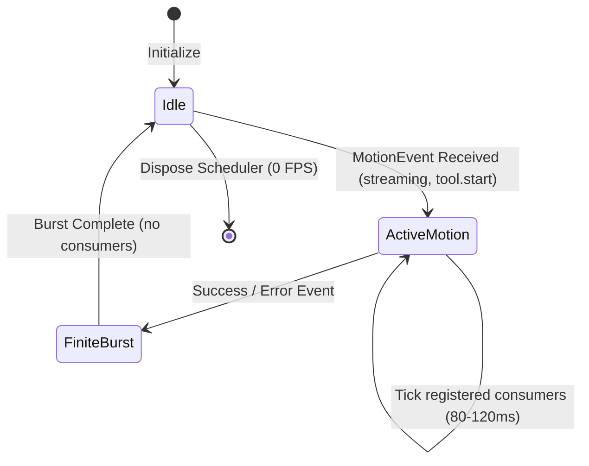

# Semantic Motion Engine & Scheduler

## Architectural Invariants

1. **Centralized Dispatch**: Components never launch ad-hoc `setInterval()` loops. All rendering cadences are driven by a single `MotionScheduler`.
2. **0 FPS Idle Guarantee**: When no animations or active consumers exist, timers are torn down completely. CPU usage is strictly 0%.
3. **Semantic Event Driven**: Animations are triggered by semantic agent lifecycle events (`streaming`, `tool.start`, `policy.deny`), not arbitrary frame tickers.
4. **Pure Function Calculations**: Motion algorithms, frame interpolations, and physics math are pure, unit-testable functions independent of the TUI renderer.

---

## Semantic Motion Events

```typescript
export type MotionEvent =
  | "idle"           // System at rest
  | "thinking"       // Agent formulating response
  | "streaming"      // Token output active
  | "tool.start"     // Invoking external tool
  | "tool.end"       // Tool execution resolved
  | "idea.capture"   // Intent/Idea logged to deck
  | "skill.insert"   // Skill inserted into editor
  | "policy.deny"    // Action blocked by guardrail
  | "repair"         // Healing or recovering from error
  | "compact"        // Context window compaction
  | "success"        // Task completed successfully
  | "warning"        // Approaching threshold/warning
  | "error";         // Exception or fatal failure
```

---

## Output Channels & Event Routing Matrix

There are six independent visual output channels:
- **`workingGlyph`**: Spinner or working status glyph in the prompt / header.
- **`signal`**: Animated track in the powerline.
- **`deckTransient`**: Ephemeral banner or toast inside the Deck overlay.
- **`panelIndicator`**: Localized progress indicator in active sub-panels.
- **`borderEmphasis`**: Transient glow or color pulse along outer frame borders.
- **`ambient`**: Subtle low-frequency breath when explicitly enabled.

```
┌───────────────┬──────────────┬──────────────┬───────────────┬─────────────────┬─────────────────┬───────────┐
│ EVENT         │ WORKING GLYPH│ SIGNAL ANIM  │ DECK TRANSIENT│ PANEL INDICATOR │ BORDER EMPHASIS │ AMBIENT   │
├───────────────┼──────────────┼──────────────┼───────────────┼─────────────────┼─────────────────┼───────────┤
│ idle          │ —            │ —            │ —             │ —               │ —               │ ● (Opt)   │
│ thinking      │ ● Pulse      │ ● Dim Sweep  │ —             │ —               │ —               │ —         │
│ streaming     │ ● Active     │ ● Hot Sweep  │ —             │ ● Token Flow    │ —               │ —         │
│ tool.start    │ ● Working    │ ● Segment Run│ —             │ ● Tool Status   │ —               │ —         │
│ tool.end      │ —            │ ● Settle     │ —             │ ● Checkmark     │ —               │ —         │
│ idea.capture  │ —            │ —            │ ● "+1 Idea"   │ —               │ —               │ —         │
│ skill.insert  │ —            │ ● Edge Jump  │ ● Toast       │ —               │ —               │ —         │
│ policy.deny   │ —            │ —            │ ● Blocked Card│ —               │ ● Error Flash   │ —         │
│ repair        │ ● Spinner    │ —            │ ● Recovery    │ ● Diagnostic    │ —               │ —         │
│ compact       │ ● Compress   │ ● Shrink Bar │ ● Compact Msg │ ● Context Bar   │ —               │ —         │
│ success       │ —            │ ● Bloom (Fin)│ ● Done Banner │ —               │ ● Success Flash │ —         │
│ warning       │ —            │ —            │ ● Warning Card│ —               │ ● Warn Flash    │ —         │
│ error         │ —            │ —            │ ● Error Modal │ —               │ ● Error Flash   │ —         │
└───────────────┴──────────────┴──────────────┴───────────────┴─────────────────┴─────────────────┴───────────┘
```

---

## Channel Cadences & Scheduler Design

Different visual elements operate at distinct frame rates to optimize visual clarity while conserving system resources:

| Channel | Target Cadence | Lifecycle |
| :--- | :--- | :--- |
| **`workingGlyph`** | `80ms – 120ms` per frame | Active while agent processes |
| **`signal` Sweep** | `80ms – 120ms` per frame | Active during stream / tool execution |
| **`panelIndicator`** | `120ms – 250ms` per frame | Active while sub-view is busy |
| **`borderEmphasis`** | `200ms – 400ms` total burst | Finite (1 to 3 frames) |
| **`deckTransient`** | `250ms – 500ms` total display | Finite auto-dismissing |
| **`ambient` Idle** | `250ms – 750ms` per frame | Runs only when explicitly opted-in |

### State Transition Diagram



---

## Motion Definition Schema (`MotionDef`)

Motions are defined declaratively as pure data structures:

```typescript
export interface MotionDef {
  id: string;
  name: string;
  category: "wishcraft" | "matrix" | "procedural" | "classic" | "custom";
  kind: "frames" | "generator";
  loop: "while-active" | "finite" | "ambient";
  colorRole: keyof WishcraftTokens;
  fallbackGlyph: string;

  // Discrete Frame Sequences
  frames?: string[];

  // Procedural Generator Specification
  generator?: {
    geometry: "linear" | "orbit" | "wave" | "bloom" | "liquid";
    interval: number;
    trailLength?: number;
    radius?: number;
    direction?: "forward" | "reverse" | "pingpong";
    easing?: "linear" | "sinusoidal" | "exponential";
  };
}
```
