# Wishcraft vNext — Stacked PR Release Plan

## Goal

Wishcraft is Pi's animated operator layer — intent, skills, ideas, guardrails, and session state made visible and controllable without turning Pi into an IDE.

The vNext release establishes five foundational pillars:

1. **Deck** — The unified interactive control surface (`Alt+P` / `/wishcraft` and deep-link routes).
2. **Signal** — The motion-aware animated powerline and status surface (`/signal`, with `/powerline` as compatibility alias).
3. **Motion** — A unified, zero-overhead event-driven terminal animation engine.
4. **Craft** — First-class workflows for Skills, Ideas, Guardrails, and session tools.
5. **Appearance** — Ten structural presets, live semantic design tokens, and a full motion gallery with fuzzy search customizer.

---

## Working Method: Stacked PRs

Each pull request branches off the immediately preceding PR branch (`vnext/00-design` $\rightarrow$ `vnext/01-motion-engine` $\rightarrow$ ... $\rightarrow$ `vnext/08-craft-docs`) and must be reviewed, tested, and merged in strict linear order.

```mermaid
graph LR
  PR0["PR0: Design Corpus"] --> PR1["PR1: Motion Engine"]
  PR1 --> PR2["PR2: Semantic Tokens"]
  PR2 --> PR3["PR3: Preset Contract"]
  PR3 --> PR4["PR4: Animated Signal"]
  PR4 --> PR5["PR5: Wishcraft Deck"]
  PR5 --> PR6["PR6: Appearance & Gallery"]
  PR6 --> PR7["PR7: First-Class A11y"]
  PR7 --> PR8["PR8: Craft, Skills & Docs"]
```

### Quality & Execution Invariants

- **Zero Breakage**: Every single PR must keep `npm run typecheck && npm test && npx madge --circular` passing 100%.
- **English UI Only**: All UI strings, labels, hints, and log outputs must be in clean, idiomatic English.
- **Pure Function Testability**: All motion mathematics, preset resolution, token derivations, and event routing must be pure functions testable in Vitest/Node without headless `ctx.ui` dependencies.
- **Backward Compatibility**: Existing `PresetDef` fields remain intact; all new fields (`tokens`, `chrome`, `signal`, `motion`, `deck`, `welcome`, `glyphs`) are optional so pre-existing presets continue to render seamlessly.
- **Architecture Boundaries**: The Deck is implemented as a `ctx.ui.custom` overlay within the Pi extension sandbox. No root-TUI hijacking and no mouse handlers on the live terminal footer.

---

## PR Specifications Breakdown

### PR 0 — Design Corpus (Docs Only)

- **Branch**: `vnext/00-design`
- **Impacted Paths**: `docs/design/*`, `docs/index.md`, `ROADMAP.md`
- **Scope & Deliverables**:
  1. Land the complete vNext design specifications (`vnext-overview.md`, `theme-contract.md`, `presets.md`, `motion-system.md`, `signal.md`, `accessibility.md`, `motion-gallery.md`, `deck-layout.md`, `responsive.md`, `regression-testing.md`).
  2. Document explicit ROADMAP directional reconciliations:
     - *Repeating Motion Scheduler vs Perf Budget*: Introducing a multi-cadence scheduler that drops to strict 0 FPS when idle, perfectly aligning with performance and low CPU usage requirements.
     - *Deck Scope*: Formalizing the Deck as a multi-route `ctx.ui.custom` modal overlay, upholding the "no third control surface" and "no live footer mouse" principles.
- **Done When**: All design documents are committed, cross-referenced in `docs/index.md` and `ROADMAP.md`, with zero runtime code changes in `src/`.

---

### PR 1 — Motion Engine (Core Foundation) — landed

- **Branch**: `vnext/01-motion-engine`
- **Shipped as**: `src/motion/{types,catalog,policy,frames,scheduler,index}.ts`, `tests/motion-engine.test.ts` (25 tests)
- **Note**: `MotionScheduler` takes an injectable timer factory (defaulting to `createCoalescingTimer`) and an injectable clock, which is how the 0 FPS lifecycle is asserted without real timers. The router is `channelsForEvent` / `allowedChannels` rather than a separate class.
- **Scope & Deliverables**:
  1. Create `src/motion/` subsystem.
  2. Implement `MotionScheduler`: generalises single-shot coalescing timers into a unified repeating loop supporting per-consumer cadences:
     - Micro-spinner / Glyphs: `80–120ms`
     - Signal Sweep: `80–120ms`
     - Ambient Idle: `250–750ms`
     - Finite Success / Burst: `250–500ms` total duration
  3. Strict **0 FPS Idle Guarantee**: When no active animations or consumer subscriptions exist, timers are cleared and CPU usage is 0%.
  4. Type Definitions:
     - `MotionEvent`: `"idle" | "thinking" | "streaming" | "tool.start" | "tool.end" | "idea.capture" | "skill.insert" | "policy.deny" | "repair" | "compact" | "success" | "warning" | "error"`
     - `MotionChannel`: `"workingGlyph" | "signal" | "deckTransient" | "panelIndicator" | "borderEmphasis" | "ambient"`
  5. `MotionRouter`: Routes semantic events to active visual channels.
  6. Data-driven `MotionDef` schema supporting both frame arrays and procedural generators (orbit, breathe, wave, bloom, relay).
- **Done When**: Unit tests verify frame calculations, cadence throttling, event dispatch, and 0 FPS idle lifecycle without relying on `ctx.ui`.

---

### PR 2 — Semantic Design Tokens (Crush Pattern) — landed

- **Branch**: `vnext/02-tokens`
- **Shipped as**: `WishcraftTokens` in `src/config/types.ts`, mapping and resolution in `src/config/tokens.ts`, wired through `src/extension/core/segment-context.ts`, `tests/tokens.test.ts` (10 tests)
- **Notes**: the token file lives under `src/config/` rather than `src/theme/` so it sits beside `PresetDef` and keeps `madge --circular` clean. Pi's four `thinking*` colors pass through untokenised; they belong to Pi's thinking levels, not the Wishcraft palette. `DEFAULT_TOKENS` reproduce `getDefaultColors()` exactly, which is asserted by test.
- **Scope & Deliverables**:
  1. Introduce `WishcraftTokens` structure:
     - Surfaces: `surface`, `surfaceRaised`
     - Typography: `text`, `textMuted`
     - Brand / Accent: `primary`, `secondary`, `accent`
     - Feedback / State: `success`, `warning`, `error`
     - Interaction: `focus`, `selection`
     - Motion: `motionDim`, `motionHot`, `motionTrail`
  2. Map legacy `SemanticColor` keys (`model`, `gitClean`, `gitDirty`, `context`, `cost`, `queue`, `border`) to `WishcraftTokens` with 100% backward compatibility.
  3. Ensure `ColorValue` continues supporting both Pi native `ThemeColor` tokens and custom `#hex` codes.
- **Done When**: All color resolution routes through the token layer with zero visual regressions across all legacy preset color configurations.

---

### PR 3 — Structural Preset Contract & 10 Signature Presets — landed

- **Branch**: `vnext/03-preset-contract`
- **Impacted Paths**: `src/config/types.ts`, `src/config/structural-presets.ts`, `src/config/appearance.ts`, `tests/structural-presets.test.ts`
- **Scope & Deliverables**:
  1. Extend `PresetDef` with optional structural specifications: `tokens`, `chrome`, `signal`, `motion`, `deck`, `welcome`, `glyphs`.
  2. Implement the **10 Structural Presets**:
     - **Lanternwake** (Default Wishcraft Identity): Warm amber/ember tones, rounded frames, powerline separators, ember breathe motion.
     - **Threadbound**: Woven craft aesthetic, indigo palette, knot separators (`╼·╾`), stitch travel motion.
     - **Scryglass**: Glass/lens instruments, cyan/violet capsule segments (`╭ ╮`), refraction sweep motion.
     - **Runebloom**: Organic alchemical sigils, gold/moss tones, sparse anchors, finite event bloom motion.
     - **Moonwell**: Lunar night arcs (`◜◝◞◟`), silver/navy palette, lunar orbit breathe motion.
     - **Hexforge**: Industrial heavy block geometry (`█`, `⬡`), heat orange palette, heat propagation motion.
     - **Vellum**: Editorial grimoire, parchment/ink tones, borderless line reveal motion.
     - **Wisp**: Minimal ethereal whitespace, mist grey/ice blue, phase drift ambient motion.
     - **Starweave**: Celestial constellation nodes (`✦╲╱`), star separators, path traversal motion.
     - **Crucible**: Liquid alchemical cells (`░▒▓█`), obsidian/magma palette, liquid level rise motion.
  3. Ensure complete decoupling: Users can mix base preset + signal layout + palette + motion language + glyph sets.
- **Done When**: All 10 presets are registered, tested for correct fallback handling (Nerd vs ASCII), and verified alongside the 7 legacy presets.

---

### PR 4 — Animated Signal (Powerline vNext) — landed

- **Branch**: `vnext/04-signal`
- **Impacted Paths**: `src/signal/*`, `src/extension/ui/status-line-renderers.ts`, `src/extension/session/session-lifecycle.ts`, `src/extension/commands/commands.ts`, `tests/signal.test.ts`
- **Scope & Deliverables**:
  1. Re-architect the powerline renderer into **Signal**: a motion-aware, 3-lane powerline:
     - **Left Lane**: Model & Git status
     - **Center Lane**: Live activity & tool state
     - **Right Lane**: Context window usage & command queue
  2. Connect Signal rendering to `MotionScheduler`: animated sweeps (e.g. traveling pulse or heat relay) only trigger during active streaming or tool execution.
  3. Register `/signal` as the primary preferred command while maintaining `/powerline` as a transparent compatibility alias.
  4. Preserve strict per-segment error boundary and fault isolation.
- **Done When**: The live powerline animates smoothly during active agent work, immediately rests at 0 FPS when idle, and preserves all segment fallback safeguards.

---

### PR 5 — The Wishcraft Deck (Unified Control Surface) — landed

- **Branch**: `vnext/05-deck`
- **Impacted Paths**: `src/extension/ui/deck/*`, `src/extension/commands/commands.ts`, `src/extension/settings/wishcraft-config.ts`, `tests/deck.test.ts`
- **Scope & Deliverables**:
  1. Build the unified Deck overlay engine (`src/extension/ui/deck/`) using `ctx.ui.custom`.
  2. Bind `Alt+P` and `/wishcraft` to `openWishcraftDeck("home")`.
  3. Implement deep links: `/signal`, `/skills`, `/skills doctor`, `/ideas`, `/usage` routes.
  4. Build Deck Routes:
     - **Home**: Live session state, animated pulse, context percentage bar, next intent card, activity feed, skills health overview (no raw cost counters or static percentage grids).
     - **Signal**: Powerline lane and module configuration.
     - **Skills**: Skill catalog and diagnostics.
     - **Ideas**: Captured thoughts and intent notes.
     - **Guardrails**: Safety policy toggles and log history.
     - **Shell**: Terminal environment & tooling diagnostics.
     - **Usage**: Context and session metrics.
     - **Appearance**: Preset, palette, and chrome controls.
     - **Motion**: Animation settings and gallery trigger.
     - **Shortcuts**: Fast keyboard navigation reference.
     - **Diagnostics**: Health check and terminal capability inspector.
  5. Employ a single continuous outer border frame with shared navigation headers, search inputs, modal pickers, preview cards, and key hints (no cheap nested cards).
- **Done When**: `Alt+P` opens the full Deck with responsive route switching, keyboard shortcuts (`g s`, `g i`, `/`, `Esc`), and smooth rendering.

---

### PR 6 — Appearance Route, Motion Gallery & Composer — landed

- **Branch**: `vnext/06-appearance`
- **Impacted Paths**: `src/extension/ui/deck/routes/appearance.ts`, `src/extension/settings/wishcraft-config.ts`, `src/motion/gallery/*`, `tests/appearance/*`
- **Scope & Deliverables**:
  1. Appearance sub-routes: `Presets`, `Palette`, `Signal`, `Motion`, `Glyphs`, `Layout`, `Accessibility`.
  2. **Motion Gallery**: Interactive catalog covering 50+ definitions grouped into:
     - `Wishcraft` (Ember, Wisp, Bloom, Relay)
     - `Matrix` (Lemniscate, Lunar, Wing, Petal)
     - `Procedural` (Helix, Orbit, Ripple, Wave)
     - `Classic` (Braille, Quarter, Bar, Bounce)
     - `Favorites` & `Custom`
  3. **Motion Composer**: Interactive tool to preview and tweak frame arrays, generator parameters (radius, trail, interval, easing), and assign motions to semantic channels.
  4. Replace flat settings lists with **Fuzzy Search Configurator** (`/ appearance search`).
  5. Live-reload on all configuration mutations.
- **Done When**: Users can search any setting, preview motions in real time, customize animations, and save settings instantly.

---

### PR 7 — First-Class Accessibility & Fallbacks — landed

- **Branch**: `vnext/07-accessibility`
- **Impacted Paths**: `src/motion/accessibility.ts`, `src/theme/detect.ts`, `src/theme/icons.ts`, `tests/accessibility/*`
- **Scope & Deliverables**:
  1. Comprehensive Motion Levels:
     - `Full`: Continuous sweeps, ambient glows, micro-spinners, and transitions.
     - `Reduced`: Continuous motion disabled; replaced with instantaneous discrete state updates.
     - `Functional Only`: State-critical indicators enabled; decorative ambient effects disabled.
     - `Off`: Completely disables all repeating animations (0 FPS permanent).
  2. Environment Degradation Modes:
     - `NO_COLOR`: Disables ANSI color codes while retaining glyph animations and spacing.
     - `Screen Reader Mode`: Motion disabled; delivers stable, high-contrast text strings.
     - `Non-Truecolor / 8-Color Terminals`: Automatic palette quantization with ASCII glyph fallback.
  3. Closes ROADMAP P1 Gap #4.
- **Done When**: Automated test suites verify compliant rendering under `NO_COLOR=1`, `TERM=dumb`, reduced-motion flags, and ASCII-only terminals.

---

### PR 8 — Skill Workbench, wishcraft-tui Skill & Complete Docs — landed

- **Branch**: `vnext/08-craft-docs`
- **Impacted Paths**: `src/extension/skills/*`, `skills/wishcraft-tui/*`, `README.md`, `docs/*`, `ROADMAP.md`
- **Scope & Deliverables**:
  1. Upgrade Skill Manager into a full **Skill Workbench**:
     - Detailed split-pane layout: List + Metadata + Health checks + Usage sparklines + Content preview.
     - Inline Creation Wizard on `N` (guided metadata, triggers, and boilerplate).
  2. Create `skills/wishcraft-tui/` project skill:
     - `SKILL.md`
     - Comprehensive reference catalog (`references/product-language.md`, `deck-layout.md`, `signal.md`, `motion-system.md`, `motion-gallery.md`, `theme-contract.md`, `accessibility.md`, `responsive.md`, `regression-testing.md`).
  3. Update `README.md`, `docs/commands.md`, `docs/configuration.md`, and `ROADMAP.md` reflecting the new architecture and milestone completion.
- **Done When**: The skill workbench is fully interactive, the AI skill is bundled and functional, and all documentation is complete and consistent.
